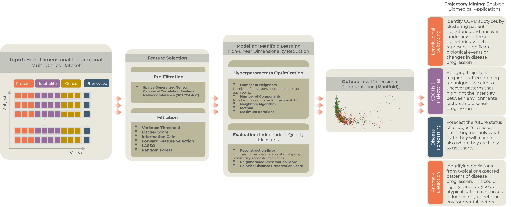

# TrajOmics: An Omni-Purpose Trajectory Mining Pipeline for Multi-Omics Longitudinal Analysis

  

## Overview

**TrajOmics** is an AI-driven framework for analyzing disease trajectories using longitudinal multi-omics data. It combines non-linear dimensionality reduction with trajectory mining to uncover complex disease progression patterns. TrajOmics is designed to handle high-dimensional, heterogeneous data while preserving key molecular drivers, offering a novel approach to disease subtyping and progression modeling.

---
## Architecture


---
## Key Features

- **High-Quality Dimensionality Reduction:** Utilizes Locally Linear Embedding (LLE) for robust, non-linear dimensionality reduction.
- **Feature Selection & Hyperparameter Optimization:** Integrates statistical feature selection with hyperparameter tuning for optimal model performance.
- **Network-Based Filtering:** Leverages Sparse Generalized Tensor Canonical Correlation Analysis Network (SGTCCA-Net) to capture complex feature relationships.
- **Trajectory Clustering:** Identifies distinct disease progression patterns, enabling personalized disease management.
- **Cross-Validation and Robustness Testing:** Validates the stability of the generated manifold across multiple visits and sampling conditions.

---

## Motivation

Longitudinal multi-omics datasets present unique challenges:
- **High Dimensionality and Heterogeneity:** Risk of overfitting and poor generalization with traditional methods.
- **Capturing Molecular Complexity:** Existing models often overlook key molecular drivers.
- **Scalability and Computational Challenges:** Difficulty in scaling to large datasets.
- **Dynamic Temporal Complexity:** Challenges in modeling disease progression over time.

**TrajOmics** addresses these challenges by combining advanced dimensionality reduction with robust feature selection and trajectory mining, enabling more accurate disease subtyping and progression modeling.

---

## Methodology

### 1. **Dimensionality Reduction**
- **Non-Linear Manifold Learning:** Locally Linear Embedding (LLE) is used to capture complex, non-linear relationships.
- **Hyperparameter Optimization:** Fine-tuning the number of neighbors and components for optimal manifold construction.

### 2. **Feature Selection and Network-Based Filtering**
- **Statistical Feature Selection:**
  - Variance Threshold
  - Random Forest
  - Forward Feature Selection
  - LASSO
  - Information Gain
  - Fischer Score
- **Network Inference:** Sparse Generalized Tensor Canonical Correlation Analysis Network (SGTCCA-Net) to enhance feature relevance.

### 3. **Trajectory Clustering**
- Identifies distinct disease progression patterns.
- Captures temporal dynamics to enhance disease modeling and personalized healthcare.

---

## Dataset

**Chronic Obstructive Pulmonary Disease (COPD)** dataset from the **Subpopulations and Intermediate Markers in COPD Study (SPIROMICS)**:
- Longitudinal multi-omics data
- Captures disease progression over multiple visits
- Ideal for trajectory mining and subtyping

---

## Installation

```bash
git clone https://github.com/<your-username>/TrajOmics.git
cd TrajOmics
pip install -r requirements.txt
